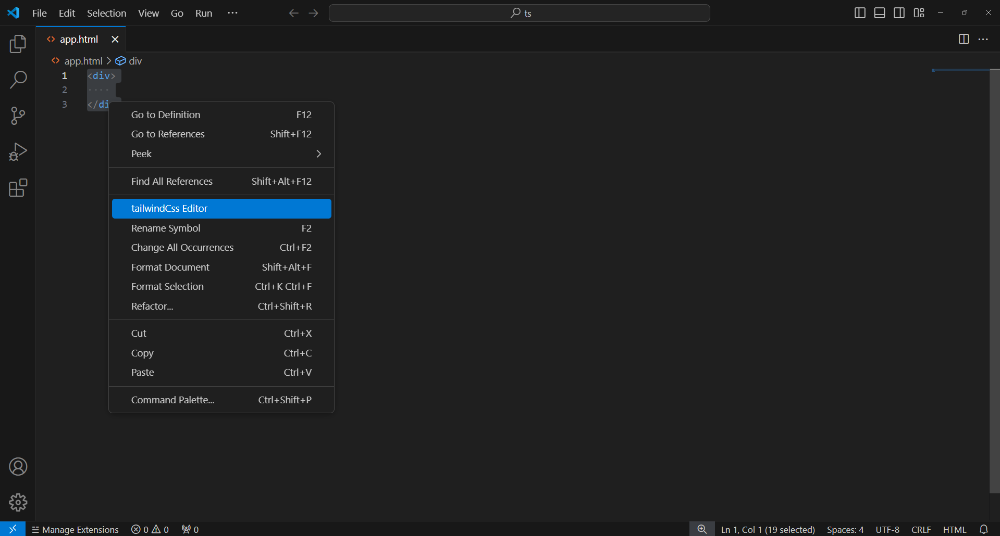
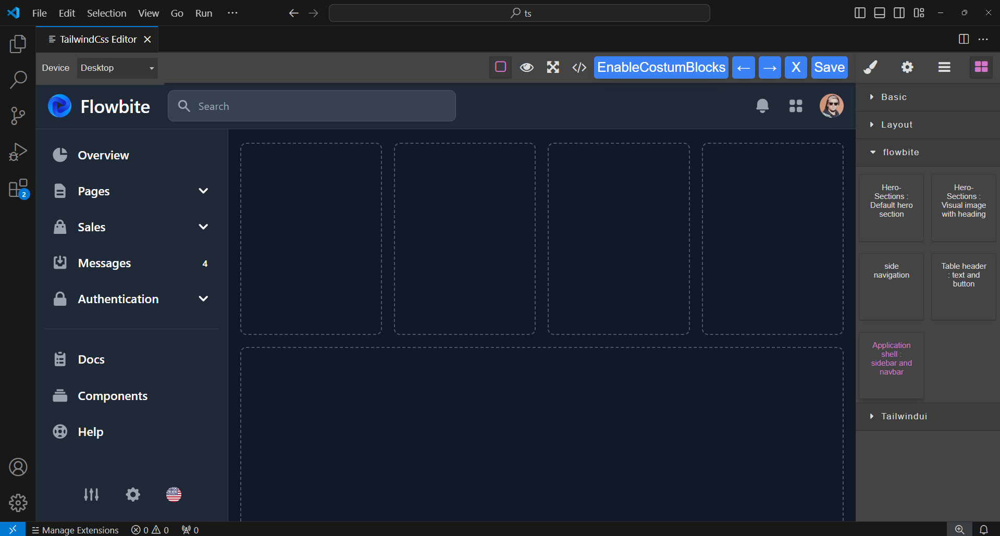
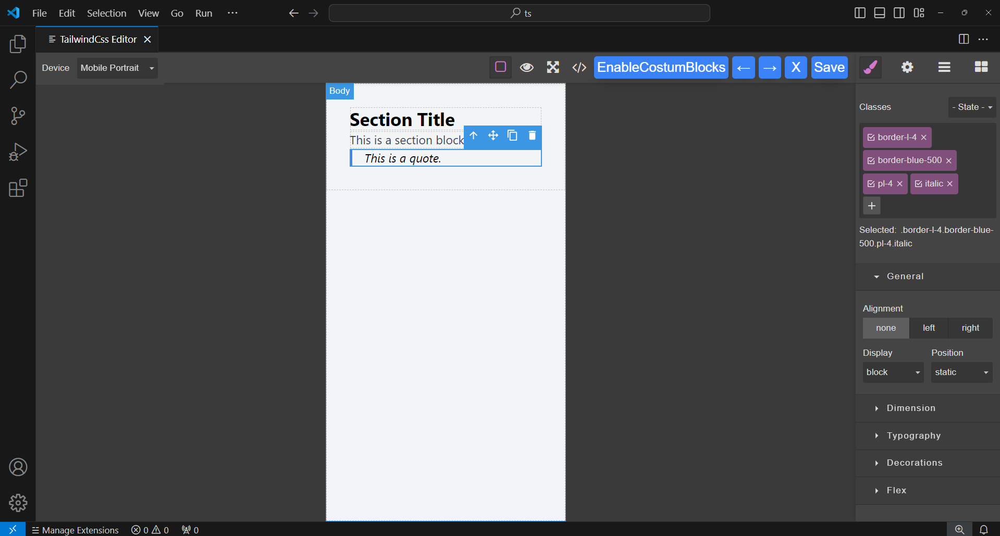

# Tailwindcss Editor README
This VS Code extension enables developers to :
- easily modify Tailwind CSS classes on HTML components
- including both custom components and prebuilt components .

## Usage
- Select a Component or Element & Edit with `TailwindCss Editor` 
    
- Click to Preview & Drag to Insert : Click on the block to see a preview, drag it to insert the HTML.
    
- Modify Classes & Save Changes
    

## Known Issues
- The extension currently works only with Tailwind CSS classes, and may not support other CSS frameworks.
- After installing the extension, you might need to restart or reload VS Code for the extension to fully activate and work properly.

# License
This project is licensed under the MIT License - see the LICENSE file for details.

#### the logo of extension has been designed using resources from Flaticon.com
Flaticon License : Free for personal and commercial purpose with attribution.